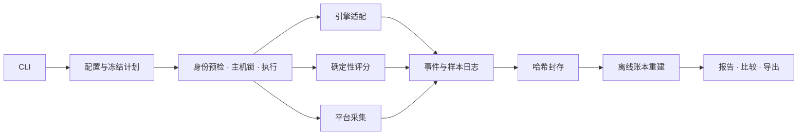

# 当前架构

本文件描述活动源码的职责、执行和证据边界。数据格式见[数据契约](data-contract.md)，用户语法见 [CLI 接口](cli-surface.md)，平台能力与实测范围见 [README](../README.md)。

产品测量本地 AI 在冻结任务上的质量、等待时间和资源需求，使用确定性评分和可核验证据。
不包含自动模型下载、服务编排、模型裁判、社区账号或多机调度。通路见[流程图](show-me-system-flow.html)。

## 一条证据通路



| 层                | 责任与边界                                                                                            |
| ----------------- | ----------------------------------------------------------------------------------------------------- |
| CLI / 配置 / 计划 | 校验参数、解析路径和凭据引用，冻结任务顺序与预算；stdout 输出 JSON（设备检测默认摘要），诊断走 stderr |
| 契约              | 一个版本常量、一个 kind 注册表和一套结构/语义入口；Schema 合法不替代跨记录校验                        |
| 执行              | 单次配置编译为一个 workload、一个 trial；显式计划执行多轮实验，共用 Journal 与 ledger                 |
| 适配器            | 核验固定引擎能力，解析普通/流式响应、用量、结束及空闲证据；不管理外部服务生命周期                     |
| 评分器            | 以冻结题目、答案与政策做纯计算；不调用模型裁判，不访问网络                                            |
| 采集器            | 按来源和窗口输出样本及缺测原因，不改变答案质量；平台能力独立声明                                      |
| 存储              | 凭据脱敏、追加日志、刷盘、原子快照和封存；文件证据为事实源                                            |
| 离线              | 从保存事件和评分重建账本，校验来源后生成报告与比较；索引、汇总、HTML 可重新生成                       |

活动源码位于 `src/inferyard/`。本机 `validation/` 源码快照仅用于追溯，不随 Git 工作树或发行包交付。Windows 单次及受支持的批量 CPU/CUDA 通路保留进程身份、锁与原生内存采集。macOS 单次和批量共用请求生命周期，通过平台工厂选择原生身份与 `macos-resource.v1` 采集器；Linux `/proc` 采集不进入其他平台的原生通路。实现与验收范围见 [macOS 说明](../MACOS.md)。

## 源码领域包

| 包                                 | 责任                                                                |
| ---------------------------------- | ------------------------------------------------------------------- |
| `cli/`、`application/`             | 参数、请求构造、输出呈现与错误映射；共享请求/结果类型及延迟命令分派 |
| `contracts/`、`config/`            | 唯一结构/语义契约；配置、题包、冻结计划与声明绑定                   |
| `runtime/`、`evidence/`            | 请求、取消、排空与安全控制；日志、封存、账本及显式历史迁移          |
| `analysis/`、`reporting/`          | 评分、指标和比较计算；离线报告、重评分与导出                        |
| `platforms/`、`extensions/`        | 设备与进程身份、平台采集；独立扩展协议及执行工作流                  |
| `adapters/`、`data/`、`templates/` | 引擎传输和解析；随安装包交付的方法/指标目录与报告模板               |

`registry.py` 和 `provenance.py` 位于根包，分别管理目录注册和源码身份。

## CLI 与应用边界

- `main(argv=None, *, handlers=None) -> int` 是控制台和模块入口。CLI 负责参数、输入校验、请求构造和输出呈现；业务执行器返回结果，不向 stdout 写诊断。`device-check` 默认人类摘要，显式 JSON 保留既有结果外层，其他命令仍为 JSON；格式参数不进入应用请求。
- `CommandRequest`、`CommandResult`、`Handler` 只定义在 `application/types.py`；业务模块不依赖 CLI，CLI 重导出同一对象。
- `--help`、`--versions` 和 `--schema` 只注册参数及读取元数据，不加载实时后端。Schema 注册表只依赖契约包与版本常量；语义验证在解析时调用。
- 应用分派显式覆盖注册命令，未知请求拒绝。`run --plan` 和 `resume` 进入批量路径，单次运行与专项命令进入各自处理器。
- 规范命令和兼容入口适配到已有业务动作，结果保留调用入口名。`application/verification.py` 识别产物并延迟调用专用验证器；CLI 不复制其验证逻辑。
- 入口统一映射输入、预检、证据、IO、内部异常与取消；退出码保持 0/2/3/4/130，stderr 不回显凭据。

安装包包含所有领域包、`data/` 和 `templates/`；模板和 catalogue 从包内资源读取，不能依赖源码检出目录。完整包摘要保留来源；新运行另按 measurement/scoring/presentation 清单记录职责身份，旧证据按保存版本解释。具体清单与依赖边界见[职责身份契约](contracts/scoped-measurement-contract.md)。

## 请求与运行

[engine-fit](engine-fit-common.md) 使用独立诊断定义和引擎观察接口，复用主机锁、dirty 恢复与原生资源采集。vLLM / SGLang 绑定模型目录，llama.cpp 绑定单 GGUF；macOS 的
MLX-LM 绑定随包受控服务脚本及目录，LM Studio 绑定唯一已加载本机实例、CLI 观察器与
实际打开的 GGUF。原生监听和进程身份仍逐次重验。MLX 队列覆盖生成器关闭和 GPU 同步；
LM Studio 的只读观察器固定连接 `127.0.0.1` 和绑定端口；`lms` 仅传显式 `--port`，
使用本机 CLI 身份，不传 `--host` 或自动发现、启动服务。Ollama 缺少全服务
空闲来源，执行阻断。产物独立封存并离线重建，不进入正式评分或性能比较资格。
边界见 [ADR 014](decisions/014-macos-common-engines.md)、[ADR 015](decisions/015-lmstudio-local-cli-identity.md)
与[常用引擎契约](contracts/engine-fit-contract.md#常用引擎扩展)，继承原身份、取消和同资产比较条件。
[ADR 016](decisions/016-engine-fit-temperature-override.md) 允许操作者在新 plan.v3 中
显式冻结临时跳过温度停止的原因，对应 run.v4。默认和旧计划仍为 85°C；温度照常采集，
其他停止条件和恢复规则继续执行。覆盖不能在运行时切换，也不能与旧计划混合比较。
[ADR 019](decisions/019-engine-fit-memory-override.md) 追加独立的内存停止覆盖，
只在新 plan.v4/run.v5 中显式冻结原因与 null 内存下限，可与温度覆盖组合。
Guard 继续采集两类读数及缺测，报告标记各项覆盖；磁盘、身份、预算与 dirty 继续执行。
[ADR 020](decisions/020-windows-engine-fit-native.md) 为 Windows 单 GGUF llama.cpp
增加独立 run.v6；原生 FILETIME/监听、稳定进程树 working-set/CPU 秒及 NVIDIA 温度
分别注明来源。旧定义继续拒绝 Windows，其他 Windows 引擎仍明确阻断。
软件/模拟验证不授予真机或正式测评资格，见[Windows 契约](contracts/engine-fit-contract.md#windows-原生来源)。

发送模型请求前应持有主机锁，完成配置、服务身份、dirty 恢复和空闲检查；正式任务的输入、顺序、预算与停止条件应预先冻结。各执行路径的本地准备顺序可以不同。探测及实际输入预算验证后，按冻结协议执行预热、基线和正式请求，随后排空、环境终检与封存。具体次数、间隔与截止时间来自协议；诊断、预热和正式请求各有 phase，不混入正式质量分母。

服务身份联合核验模型/引擎文件哈希、模板、有效参数、PID、启动时间与端口归属。`requested` 不自动等于 `effective`；无法核验的参数为 unknown。模板后的实际输入预算不静默截断。

macOS 使用原生进程身份和 `lsof` 核验二进制及监听端点；模型绑定核验启动参数指向的文件设备号/inode，模型映射仍标为未观察。Metal 还须验证 Apple Silicon/Metal 能力、正数 offload 参数，以及已绑定且实际加载的 `libggml-metal.dylib`。这些检查不证明模型的 GPU 驻留，也不替代真实模型测评。

所有模型请求前取得主机共享锁。发送前持久化请求身份和 dirty 状态；连接关闭、低 CPU 或 `/health` 成功都不能替代可核验空闲证据。超时或取消后停止发送并按冻结期限排空；无法确认空闲时保留 dirty。恢复声明绑定当前 token，还须核验旧进程消失、新服务身份及空闲。

每个正式题目没有隐式重试。固定计划满足：

```text
planned = completed + failed + cancelled + invalid + not_executed
executed = completed + failed + cancelled + invalid
valid_executed = completed + failed
```

| 状态         | 含义                                                       |
| ------------ | ---------------------------------------------------------- |
| completed    | 协议正常终止；答案仍可判错，评分异常单独为 unscorable      |
| failed       | 模型服务、传输、协议或请求预算失败，按协议保留质量分母     |
| cancelled    | 操作者取消，不当作模型答错                                 |
| invalid      | 工具或证据故障；中断后只有 started、没有终态的请求归入此项 |
| not_executed | 未开始，保留计划身份和原因                                 |

生命周期结束不代表结果完整。评分故障不撤销执行终态或缩小分母；分母为零、无法评分或不满足整包条件时不给完整通过率。持续负载的 `planned = null`、窗口及排空语义见[实验设计](experiments/design.md)，不套用固定题序数量。

## 计量与比较

客户端计时使用单调时钟。首内容与首答案分开；空内容、心跳和元数据不触发首内容。完整协议结束与提前 EOF 分开，总截止时间不因新事件续期。SSE event、网络 chunk 与 token 不等价；token 用量注明端点来源与计数范围。

采集按绝对调度点记录读取起止、实际间隔和丢样。读取跨越 phase 或请求边界的样本不能简单归入当前请求；短请求无样本不外插。RSS、系统可用内存、显存和能量分别标明层次、单位、窗口及来源，不能互相替代或相加。PID 复用、计数回退、缺段和传感器不可得分别留原因。

macOS 原生采集 CPU、RSS、可用内存、主机换页和只读 AppleSMC 温度；频率、能耗和独立显存保留缺测。统一内存不能与 RSS 相加。来源及单位随证据保存，离线读取按保存的来源归约；CPU 启动身份和计数口径见[平台契约](contracts/macos-contract.md)。性能环境按保存平台核验原生电源策略，Linux governor/EPP 不填造；温度、原生策略或完整开销证据缺失仍阻断。正式通路总开销及目标绑定见[ADR 006](decisions/006-macos-performance-prerequisites.md)。

性能比较绑定设备、OS/驱动、引擎、任务、参数、缓存/预热、环境、测量源码和定义。unknown 不能与 unknown 视作相同；质量、耗时、资源分别判定资格。量化比较须有同源 revision，缺少基线不给收益结论。描述性差值与受控结论资格分开；只满足并列条件时不生成因果结论或赢家。

总采集开销包括采集、校验、队列、写盘、flush/fsync 和封存的完整路径。轮询开销或短预跑通过不足以授予正式性能比较资格；源码变化后重新核验实际测量来源。

## 保存与离线读取

请求身份先落盘，再发送请求；终态与评分分别保存。日志按顺序追加，必要证据写入失败即停发并保留 dirty，不继续产生无证据结果。封存 manifest 记录身份、来源和文件哈希，不哈希自身。

离线读取不发模型请求，不根据证据中的 URL 获取内容。携带包只读取包内允许的相对路径，拒绝路径穿越和越界符号链接。普通报告的外部来源可用相对路径及显式源根映射定位，定位不代替 manifest 身份；见[离线读取契约](contracts/offline-reading-contract.md)。未封存日志可读取完整前缀并报告末尾截断；中间损坏、重复记录或哈希不符不能跳过后发布完整成绩。派生物重建到新目录，原件不覆盖。

保存的 completed 请求缺评分时标 unscorable，不自动套用新评分器。显式重评分产生独立分析身份。历史格式只通过显式迁移读取，保留原件、原测量源码与评分身份；转换出的上下文标为迁移生成，不冒充测量前冻结。

凭据通过环境变量引用，不进入配置快照、日志和 Git；已知凭据在落盘前脱敏。脱敏后无法复核的评分输入不得给出可复现成绩。HTML 自包含并转义题目、答案、路径和异常信息；v3 的 SVG 提取结果局部原始渲染，脚本限制由 CSP 保证，详见[报告契约](contracts/report-contract.md#v3-svg-展示与-csp)。

## 方法与证据边界

[分析项表](reference/methods-matrix.md)是带适用前提的方法目录，不是所有设备都要跑完的套餐。工具已实现、模拟已验证、真机已通过分别登记。人工题包审核绑定题目、答案和规则哈希；自动测试不能代替人工审核。

重复同题只说明固定题集上的波动；安全停止保留原因与计数，不把未测档位写成模型不支持。受限实测留下接手步骤和验收条件，软件缺口不能归因于硬件。人工题包审核仍有效，独立操作者签收不是验收门槛。
