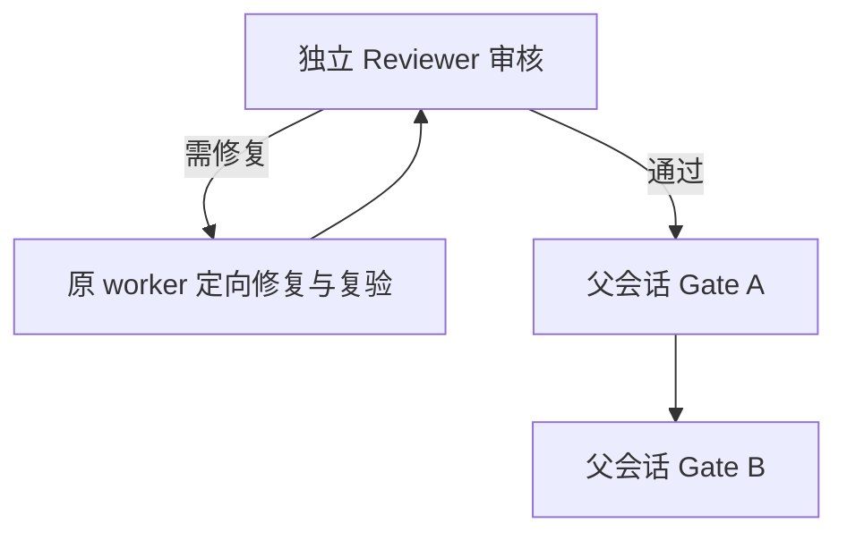

# InferYard 当前格式清理：待终审与集成工作

决策见 [ADR 038](../decisions/038-inferyard-current-format.md)，
格式和锁边界见[稳定契约](../contracts/inferyard-current-format.md)，
已完成的软件与定向检查记录在 [backlog](../backlog.md#当前格式清理与主机锁迁移)。

T0 已获 Reviewer approve，父会话已批准 P0。单 worker 完成实现后统一本地提交并停写，
本计划只列独立审核、必要修复和父会话验收；不将本地测试视为最终接受。
唯一工作区 `/private/tmp/inferyard-current-format-20261007`，分支 `codex/fix-inferyard-current-format`。
writer 核查基线 `fe1052a41afbddc1b7ceff852e794d6d872977ce`；
保护基线 `/private/tmp/inferyard-cleanup-baseline.json`。

## 待办与责任

1. 独立 Reviewer 只读审核统一提交，重点检查格式拒绝/损坏错误码、递归来源、
   current engine-fit 组合、退休事务、dirty 保留和 installed_safe_checks.v3 消费链。
2. 如有阻断项，由原 worker 在下述所有权内修复并定向复验，再交原 Reviewer。
   Reviewer 无缺陷时直接进入父会话 Gate A。
3. 父会话串行完成 Gate A、Gate B，裁定 Windows 原生未验范围及最终接受。
   任何源码修改都应重验相应边界；不继承旧候选或源项目的验收。

## 回审修复所有权

每个责任域仍只有原 worker 一位写入者；Reviewer 只读，父会话负责集成。
不回退他人修改，不创建新 agent/session；越界需求先报告。

| 责任域 / ownership | 重点文件与交付 |
| --- | --- |
| `src/inferyard/cli/`、`application/` | migration 注册/分派删除、旧格式错误映射、verification、engine_fit；新增窄 host-state 维护入口及同一 CommandRequest/Result |
| `src/inferyard/evidence/` | migration.py、migration_source.py、migration_transform.py 删除；ledger、token_budgets、来源/派生副本拒绝；原日志与封存规则保留 |
| `src/inferyard/reporting/`、`analysis/` | report/report_assets/sealed_report、comparison_report、public_package、engine_fit 验证器去旧分派；评分 phase2.v1/v2 与当前计算不改义 |
| `src/inferyard/config/` | bundle/bundle_review 删除升级生成器但保留审核证明；public_plan/public_recipe 去旧策略；engine_fit_assets 去仅历史目录回退 |
| `src/inferyard/runtime/`、`platforms/` | lock.py 及窄维护模块、windows_host_paths/platform_io；pending/ready、退休标记和不可变原字节凭据；常态只用新锁/state；不改停止、身份、取消/排空边界 |
| `src/inferyard/templates/` | 删除历史快照与 report_v1.html；根 report*.html 当前模板保留 |
| `src/inferyard/data/implementation-files.json`、`implementation_identity.py` | 根据删除/新增文件更新职责归属，摘要反映实际源码；不借机改题包、目录数据或身份算法 |
| `scripts/` 的历史兼容与发行检查 | 删除 migrate_request_snapshots.py、prepare_windows_evidence.py 等仅历史输入工具；observer_stream/analyze_observer 去 v1；release_common 安装结果校验升 v3，prepare/verify_release_candidate 消费链和允许列表同步；其余有副作用脚本不运行 |
| `observer/` 的协议边界测试 | 保留 Go lab_observer.v2 writer、原生后端与六目标；仅调整关联断言，不重编号 |
| `tests/` | 旧成功兼容用例替换为拒绝路径；重点 installed_probe/run_installed/prepare_inputs、test_release_candidate/test_release_fixture，以及固定旧 HostLock 拒绝夹具、事务崩溃与新锁测试 |
| `AGENTS.md`、README/CONTRIBUTING、`docs/`、`scripts/README.md` | 删除冲突的历史支持承诺，说明 unsupported 和维护入口；原 ADR 保留理由、注明局部取代；平台实现/验收分开 |
| `pyproject.toml`（仅打包允许列表如确需） | 删除历史模板/工具交付项；不变更 Python、uv、依赖或产品版本 |

禁止修改 `bundles/`、题包随包副本、审核资料、模型/引擎、真实配置、`validation/` 和原始证据。
`schemas/`、catalogue 及社区资源预期不变；如需改变其字节须先报告原因，不能静默重导出。
扩展当前协议不是删除目标；若需调整其他目录的导入，仅申请最小文件边界。

## 集成 Gate A 与 Gate B

Gate A 由父会话在最终集成提交执行：全量相关回归、Ruff、导出一致性、职责/导入闭包，
检查 wheel/sdist 无旧模板/迁移实现而保留当前资源；若触及 observer 执行 Go 测试与构建检查。
按[贡献指南](../../CONTRIBUTING.md#本地候选构建与安装检查)用新目录构建同批 wheel/sdist、
sdist 重建、约束文件、源码外安装及候选核验。结果必须为 installed_safe_checks.v3，
community_distribution.v2 外壳中的安装 v2 不通过新核验；不上传、不把此前候选检查当本次通过。

Gate B 使用同批安装字节，在源码外生成/verify 当前离线报告、比较、公开包和 engine-fit 合成产物；
实际离线浏览桌面/手机宽度，禁网确认 SVG/CSP、源码折叠与来源信息。
另执行隔离临时根的迁移事务中断、退休拒绝、新锁互斥与 dirty 恢复；这些不是模型测评。
至少一个实际平台完成安装闭环；其他平台分别记录未验，不继承原项目成绩。
Windows 锁迁移能力未有原生证据时保留阻断/未验范围，由父会话决定集成接受范围。

## 停写与提交边界

统一提交前核对差异、授权文件集合、保护哈希、依赖与 ID；记录实际定向检查和未验范围。
仅在当前工作树创建本地 commit，不 push、不合并、不上传 GitHub、不保存外部记忆。
提交后停写，等待独立 Reviewer 和父会话裁定；不修改 InferYard main 或原项目。

测试只使用临时根、真实子进程和合成服务；不操作系统真实 lock/state，不发模型请求。
Windows 模拟和 Go 交叉构建不作为 msvcrt/ACL/reparse、多账户及卷路径的原生验收。
