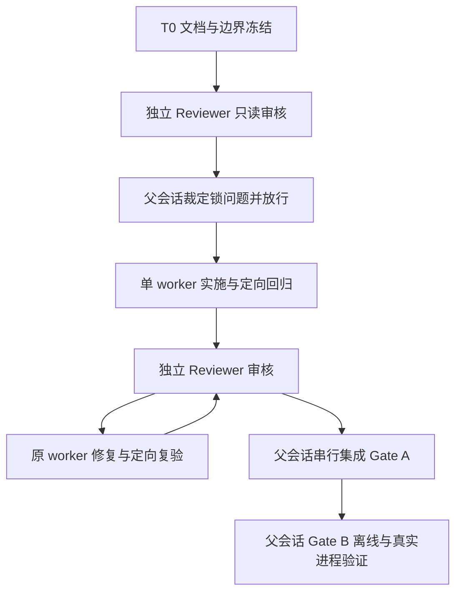

# InferYard 当前格式清理实施计划

决策见 [ADR 038](../decisions/038-inferyard-current-format.md)，
格式和锁边界见[稳定契约](../contracts/inferyard-current-format.md)；当前状态只记入[backlog](../backlog.md)。
唯一工作区 `/private/tmp/inferyard-current-format-20261007`，分支 `codex/fix-inferyard-current-format`，
T0 基线 `fe1052a41afbddc1b7ceff852e794d6d872977ce`。

## 依赖与责任

这是单 worker 实施 DAG，没有并行源码波次。Reviewer 只读；父会话唯一负责集成及最终接受。
Reviewer 无缺陷时可直接进入 A；有缺陷则经 F 回审。Windows 边界未裁定不能跳过 P0。
本 worker 不创建新 agent/session；T0 提交后停写，后续工作必须取得父会话放行。

## T0 文件所有权

仅本 worker 可写以下 7 个文件；其余源码、测试、说明与状态文件均只读：

- `docs/decisions/038-inferyard-current-format.md`
- `docs/contracts/inferyard-current-format.md`
- `docs/plans/inferyard-current-format.md`
- `docs/decisions/README.md`
- `docs/contracts/README.md`
- `docs/plans/README.md`
- `docs/backlog.md`

交付物为 superseding ADR、writer 矩阵、锁状态/失败契约、实施所有权和验收门。
边界例外：无。需要越界先报告，不改 AGENTS 或其他契约来提前宣布实施。
不触碰原项目、InferYard main、系统 lock/state；不 push、创建/上传 GitHub 或保存外部记忆。

## 放行后拟授权给单 worker 的所有权

以下是待 P0 批准的实施集合，不是 T0 当前写权限。每个责任域只有该 worker 一位写入者；
若发现目录内其他不相关功能无需修改，不做顺手重构。目录外变更先交父会话裁定。

| 责任域 / ownership | 重点文件与交付 |
| --- | --- |
| `src/inferyard/cli/`、`application/` | migration 注册/分派删除、旧格式错误映射、verification、engine_fit；新增窄 host-state 维护入口及同一 CommandRequest/Result |
| `src/inferyard/evidence/` | migration.py、migration_source.py、migration_transform.py 删除；ledger、token_budgets、来源/派生副本拒绝；原日志与封存规则保留 |
| `src/inferyard/reporting/`、`analysis/` | report/report_assets/sealed_report、comparison_report、public_package、engine_fit 验证器去旧分派；评分 phase2.v1/v2 与当前计算不改义 |
| `src/inferyard/config/` | bundle/bundle_review 删除升级生成器但保留审核证明；public_plan/public_recipe 去旧策略；engine_fit_assets 去仅历史目录回退 |
| `src/inferyard/runtime/`、`platforms/` | lock.py 及窄维护模块、windows_host_paths/platform_io；实时入口继续共用锁；不改停止、身份、取消/排空边界 |
| `src/inferyard/templates/` | 删除历史快照与 report_v1.html；根 report*.html 当前模板保留 |
| `src/inferyard/data/implementation-files.json`、`implementation_identity.py` | 根据删除/新增文件更新职责归属，摘要反映实际源码；不借机改题包、目录数据或身份算法 |
| `scripts/` 的历史兼容与发行检查 | 删除 migrate_request_snapshots.py、prepare_windows_evidence.py 等仅历史输入工具；observer_stream/analyze_observer 去 v1；构建允许列表按删除项调整；其余有副作用脚本不运行 |
| `observer/` 的协议边界测试 | 保留 Go lab_observer.v2 writer、原生后端与六目标；仅调整关联断言，不重编号 |
| `tests/` | 旧成功兼容用例替换为拒绝路径；保留最小旧格式负例及当前协议正例；锁、封存、安装检查同步 |
| `AGENTS.md`、README/CONTRIBUTING、`docs/`、`scripts/README.md` | 删除冲突的历史支持承诺，说明 unsupported 和维护入口；原 ADR 保留理由、注明局部取代；平台实现/验收分开 |
| `pyproject.toml`（仅打包允许列表如确需） | 删除历史模板/工具交付项；不变更 Python、uv、依赖或产品版本 |

禁止修改 `bundles/`、题包随包副本、审核资料、模型/引擎、真实配置、`validation/` 和原始证据。
`schemas/`、catalogue 及社区资源预期不变；如需改变其字节须先报告原因，不能静默重导出。
扩展当前协议不是删除目标；若需调整其他目录的导入，仅申请最小文件边界。

## 实施交付与定向回归

| 工作 | 必须证明的行为 |
| --- | --- |
| 当前生产闭包 | 从公开 CLI writer 到 reader/verify 的每类现行格式均可往返；engine-fit 全部合法 plan/run/platform 组合保留，非法组合仍拒绝 |
| 删除迁移与历史重算 | test_legacy_migration、test_snapshot_migration、旧 report/comparison/public/observer 成功用例改成 unsupported/输入拒绝；不得保留全套旧实现只为测试通过 |
| 题包证明 | test_bundle_migration 中“生成升级包”用例退役；用现有 v3 小夹具保留证明原哈希、等价性、原批准及逐题审核拒绝测试；仓内及随包题包 SHA 与基线一致 |
| 格式拒绝 | 已知旧版、未知版、缺版、bool 版本、坏 JSON、坏 seal、来源损坏、版本冲突、混合新旧预算、递归旧来源分别覆盖；不默默升级、默认或重评分 |
| 当前离线 | 当前 raw run/batch/plan、report7/comparison4/public5/engine-fit manifest2 正常；未封存 partial、坏 seal、source-root 映射、路径逃逸、显式 rerender 保留 |
| 锁正常与竞争 | 临时根中真实子进程：旧先持锁/新先持锁/两个迁移器竞争；失败方请求计数 0；退出释放全部自有句柄 |
| 锁故障 | 在每次 dirty/clean/初始化镜像写前后强制终止子进程；残留状态不放行；dirty 旧服务活着、PID 复用、冲突 token、权限/链接/磁盘错误均阻断 |
| 旧工具再启动 | 用保留旧锁协议的最小子进程模拟器，不调用原项目；验证新崩溃后旧看到 dirty、旧运行后新不忘 dirty、只清一处不能绕过恢复 |

锁测试用生产锁原语和真实进程，不只 monkeypatch `_lock`；所有路径注入到本次临时目录。
Windows msvcrt/ACL/reparse/FILETIME、多账户及 D 卷变化须原生验收；macOS 模拟不算 Windows 通过。
本机不运行固定系统路径的 installed_host_state.py / installed_request_chain.py。
不发真实模型请求，不运行真实迁移；端到端使用合成服务和代表性当前证据。

开发及检查先核对 mise 解释器与 uv；命令用 RTK 包装，依赖只用 `uv --frozen`。
实施 worker 先运行实际修改对应的 unit/CLI/集成子集，再 Ruff、Schema/catalogue/community `--check`；
不得靠删掉安全测试、放宽断言或全量测试中的平台 skip 宣称完成。

## 集成 Gate A 与 Gate B

Gate A 由父会话在最终集成提交执行：全量相关回归、Ruff、导出一致性、职责/导入闭包，
检查 wheel/sdist 无旧模板/迁移实现而保留当前资源；若触及 observer 执行 Go 测试与构建检查。
按[贡献指南](../../CONTRIBUTING.md#本地候选构建与安装检查)用新目录构建同批 wheel/sdist、
sdist 重建、约束文件、源码外安装及候选核验。不上传、不把 T0 或此前候选检查当本次通过。

Gate B 使用同批安装字节，在源码外生成/verify 当前离线报告、比较、公开包和 engine-fit 合成产物；
实际离线浏览桌面/手机宽度，禁网确认 SVG/CSP、源码折叠与来源信息。
另执行隔离临时根的真实进程互斥、崩溃与恢复场景；这些是系统行为证据，不是模型测评。
至少一个实际平台完成安装闭环；其他平台分别记录未验，不继承原项目成绩。
Windows 锁迁移能力未有原生证据时保留阻断/未验范围，由父会话决定集成接受范围。

## T0 检查与停写条件

按仓库已有纯文档规则检查 7 文件的 Markdown 结构、相对链接/锚点和命令，执行 `git diff --check`。
仓库未配置 Markdown formatter、当前 PATH 无 Prettier，不引入 npm 依赖；不把 Ruff 当 Markdown 检查器。
本地链接检查使用 mise Python 标准库，无依赖安装；检查无占位、冲突标记及越界文件。
当前不跑全量 pytest、构建/安装矩阵或模型；mise 状态登记若被沙箱限制，报告而不写系统目录。

提交前核对 `git status`、工作区/暂存区文件集合与基线；只暂存上述 7 文件并本地 commit。
提交后报告 SHA、矩阵、锁方案、父会话裁定项和实际检查结果，然后停写等待放行。
